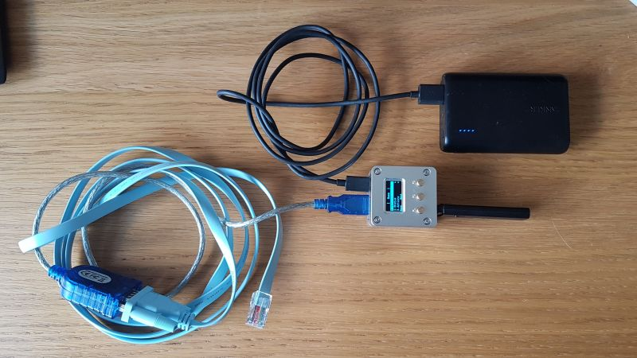

# Wi-Fi Console
*Turn your WLAN Pi in to a wireless serial console cable*

It can be annoying to have to sit in an equipment room to use the serial console port on an item of networking equipment. This module allows you to use a WLAN Pi to connect to your serial console cable via a Wi-Fi link while sat in the comfort of a nearby office, rather than sat with your laptop on the equipment room floor :) 

# User Guide

To find out to setup and use the Wi-Fi Console, check out this [userguide](doc/USERGUIDE.md).

# Contributing

If you'd like to contribute to this project, please visit our ["Contributing Guidelines"](https://github.com/WLAN-Pi/.github/blob/6c505d84a8ec6d5004958fe2289659bcdd44118f/contributing.md) page.

# Code of Conduct

Please note the [Code of Conduct](https://github.com/WLAN-Pi/.github/blob/6c505d84a8ec6d5004958fe2289659bcdd44118f/code_of_conduct.md) guidelines that apply to activities within the WLAN Pi project. 