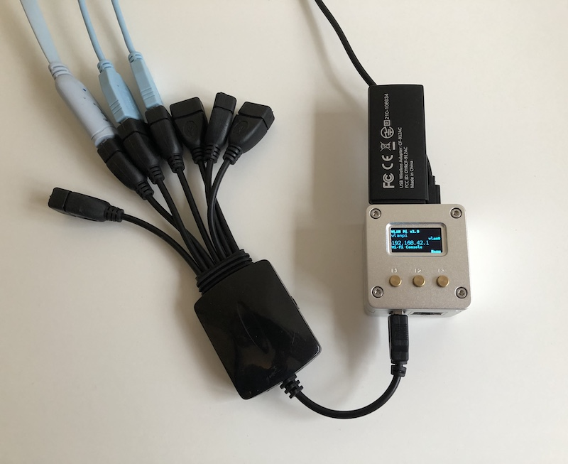
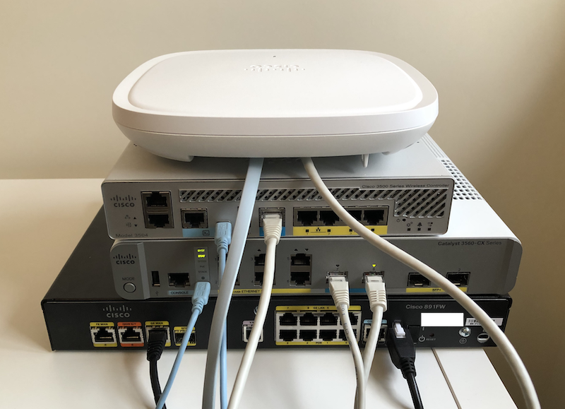
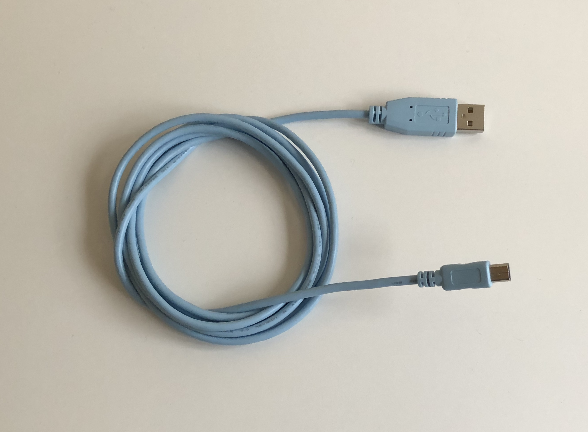

# Wi-Fi Console
*Turn your WLAN Pi in to a wireless serial console cable*

It can be annoying to have to sit in an equipment room to use the serial console port on an item of networking equipment. This module allows you to use a WLAN Pi to connect to your serial console cable via a Wi-Fi link while sat in the comfort of a nearby office, rather than sat with your laptop on the equipment room floor :) 

## Requirements

To provide a wireless console serial port using your WLAN Pi, you will need:

 - a supported, operational wireless adapter in the WLAN Pi
 - A (compatible) USB to serial cable connected to a WLAN Pi USB port

## Quickstart
If you're in a rush to get Wi-Fi Console going, here is a shortcut method of getting it up and running:

1. With your WLAN Pi hooked up to a network port, SSH to the WLAN Pi
2. Login details for a new unit: wlanpi/wlanpi
3. Execute the following CLI command:

```
sudo quickstart-wconsole
```

4. Follow the on-screen wizard instructions to set up the the wireless connection for the wireless console
5. At the end of the quickstart setup process, select the on-screen option to switch in to wireless console mode
6. Once the WLAN Pi has rebooted:
    - unplug the WLAN Pi from the network port used for setup
    - plug in your Serial/USB adapter
    - provide a power source for the WLAN Pi
    - follow the instructions in the [Using Wi-Fi Console](#using-wi-fi-console) section of this document

Full instructions for configuring Wi-Fi Console are provided below if you have additional requirements beyond the quick setup.

## Enabling Wi-Fi Console Mode

To flip the WLAN Pi in to "Wi-Fi Console" mode, using the front panel menu system select the following options

```
 Menu > Modes > Wi-Fi Console > Confirm
```

At this point, the WLAN Pi will reboot so that the new networking configuration will take effect. Following the reboot, the "Wi-Fi Console" mode is reported on the WLAN Pi display.

## Disabling Wi-Fi Console Mode

To flip the WLAN Pi back to classic mode use the front panel menu system select the following options

```
 Menu > Actions > Classic Mode > Confirm
```

The WLAN Pi will reboot and start up in the default, classic mode.

# Using Wi-Fi Console

Following the WLAN Pi reboot, by default, an SSID of "wifi_console" will be available on channel 1. You can join the SSID with a wireless client (e.g. your laptop) using the default shared key: wifipros

Once you have joined the SSID, open a telnet session to the WLAN Pi at 172.16.43.1 using network port 9600. This will provide access to the serial console cable plugged in to the USB port, operating with a serial port configuration of 9600,8,N,1.

In addition to the serial port configuration on TCP 9600 the following ports are also configured in the "ser2net" configuration file:

 - TCP port 2400 : serial port config: 2400,8,N,1
 - TCP port 4800 : serial port config: 4800,8,N,1
 - TCP port 9600 : serial port config: 9600,8,N,1
 - TCP port 19200 : serial port config: 19200,8,N,1
 - TCP port 11520 (note the missing zero please) : serial port config: 115200,8,N,1

(If you wish to experiment yourself with the network port allocations, see the /etc/wconsole/conf/ser2net.conf file)


 ## Multiple serial to USB adapters

You can now use the WLAN Pi with up to 8 USB to serial cables, via a USB hub. All 5 baud rates are still available for each cable and the last digit of the TCP port matches the serial cable number (from 1 to 8):

 - First adapter uses ports 2401, 4801, 9601, 19201, 11521 (and also ports 2400, 4800, 9600, 19200, 11520 for backwards compatibility)
 - Second adapter uses ports 2402, 4802, 9602, 19202
 - ...
 - Eight adapter uses ports 2408, 4808, 9608, 19208

Example: To connect to the third adapter at baud rate 9600, telnet to WLAN Pi's IP address on TCP port 9603. 



(Note: the octopus cable shown above is a standard USB hub)



 ## Cisco USB console cables

If you are a Cisco shop you may already have a box of unused Cisco USB console cables. Let’s put those to use. You can plug up to 8 using a USB hub to your WLAN Pi and access up to 8 terminal lines wirelessly – no drivers needed!



To access the Cisco USB console sessions, simply telnet to the WLAN Pi IP address and use one of these ports. The last digit matches the USB console cable number (from 1 to 8):

 - First USB cable uses port 2001
 - Second USB cable uses port 2002
 - ...
 - Eight USB cable uses port 2008

Example: To connect to the second USB console cable, telnet to WLAN Pi's IP address on TCP port 2002.

 ## Configurations Options

It is very likely that you will not want to use this utility with the default shared key, channel and SSID. There are two options to configure these parameters to your own custom values:

 - Run the "quickstart" CLI script
 - Edit the hostapd configuration file

Both methods are outlined below:

### Edit Config File

To change from the default settings, ensure that the WLAN Pi is operating in standard "classic"mode. Then, edit the file: /etc/wlanpi-wconsole/conf/hostapd.conf. This can be done by opening an SSH session to the WLAN Pi and using the 'nano' editor:

```
 sudo nano /etc/wlanpi-wconsole/conf/hostapd.conf
```

Change the following fields to your desired values:

```
 ssid=wifi_console
 channel=1
 wpa_passphrase=wifipros
```

Once you have made your changes, hit Ctrl-X to exit and hit "Y" to save the changes when prompted.

Next, flip the WLAN Pi back in to "Wi-Fi Console" mode as described in previous sections. After the accompanying reboot, the WLAN Pi should operate using the newly configured parameters.

(Note: if you make these changes while in "Wi-Fi Console" mode, they will not take effect. You must start in "classic" mode, make the updates, then switch to "Wi-Fi Console" mode)


# Switching to Wireless Console Mode From CLI

It is possible to flip in to Wi-Fi console mode using the Linux CLI, but it is recommended to use the WLAN Pi front panel navigation menu if you're not comfortable using the Linux CLI. 

As there are quite a few networking changes we need to make for Wi-Fi Console to operate correctly, we need to flip the WLAN Pi in to a completely new mode of operation that uses a different network configuration. The 'wconsole_switcher' script is used to switch between the usual "classic" mode of operation and the "Wi-Fi Console" mode of operation. 

## Enabling Wi-Fi Console Mode (Via CLI)

To flip the WLAN Pi in to "Wi-Fi Console" mode, SSH to the WLAN Pi and execute the following command:

```
 sudo /usr/sbin/wconsole_switcher on
```

At this point, the WLAN Pi will reboot so that the new mode will take effect. 


## Exiting Wi-Fi Console Mode (via CLI)

To switch out of "Wi-Fi Console" mode, SSH to the WLAN Pi using network address 172.16.43.1 (while connected to the Wi-Fi Console SSID, using standard port 22) and run the command: 

```
 sudo /usr/sbin/wconsole_switcher off
```

When this command is executed, the original ("classic" mode) classic mode will be restored and the WLAN Pi will reboot. After the reboot, the WLAN Pi will operate as it did before switching to "Wi-Fi Console" mode.

## Support & Feedback

Please visit the [WLAN Pi discussion site](https://github.com/WLAN-Pi/feedback/discussions/) with any feedback about the Wi-Fi Console module. 
